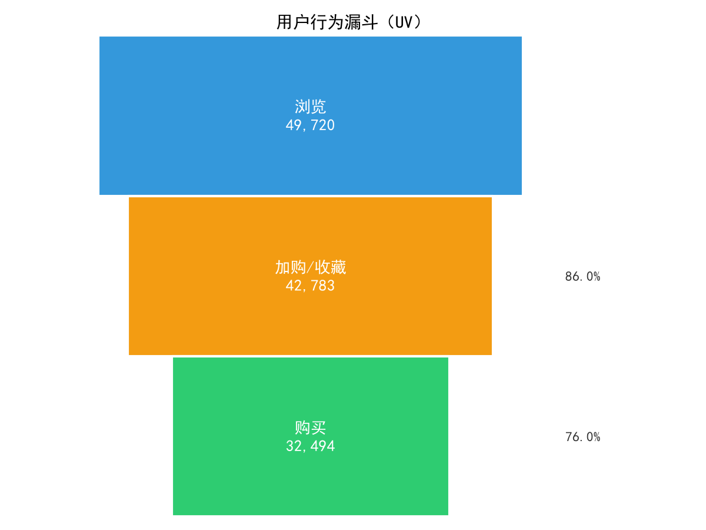
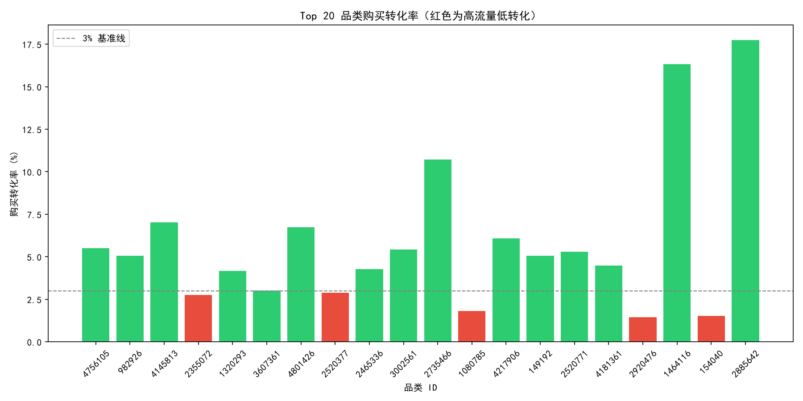
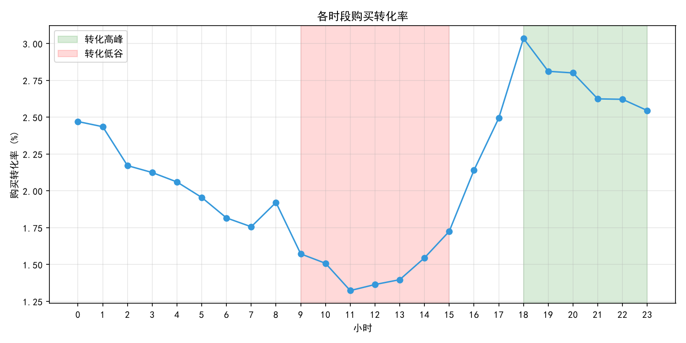

# 电商用户行为漏斗分析

基于淘宝 1 亿条用户行为数据，构建浏览 → 加购/收藏 → 购买的转化漏斗，定位最大流失环节，并从品类、时段两个维度拆解，输出产品优化建议。

## 项目背景

电商平台用户从浏览到购买存在多环节流失。本分析旨在定位最大流失环节，为产品优化提供数据依据。

## 数据

- 来源：阿里天池淘宝用户行为数据集
- 原始规模：100,150,807 条
- 采样方式：按用户随机采样 5 万用户，保留全部行为
- 清洗后规模：5,081,060 条，49,906 名用户
- 时间范围：2017-11-25 至 2017-12-03

## 方法

1. 用 DuckDB 读取 3.76GB CSV，按用户采样 5 万用户
2. 去重、时间戳转换、过滤低活跃用户和异常时间
3. 构建“浏览 → 加购/收藏 → 购买”漏斗
4. 按品类、时段两个维度拆解
5. 输出 3 条产品建议 + A/B 实验设计

## 核心发现

### 1. 整体漏斗

| 环节 | UV | 环节转化率 | 环节流失率 |
|---|---:|---:|---:|
| 浏览 | 49,720 | — | — |
| 加购/收藏 | 42,783 | 86.0% | 14.0% |
| 购买 | 32,494 | 76.0% | **24.1%** |

整体购买转化率（购买 UV ÷ 浏览 UV）= 65.35%

**加购 → 购买是最大流失环节，流失 24.1%。**

### 2. 品类维度

高流量低转化品类（购买率 < 3%）：2355072、1080785、2920476、154040

### 3. 时段维度

- 高峰：18:00–23:00，转化率约 3.0%
- 低谷：09:00–15:00，转化率约 1.5%

## 产品建议

1. 优化加购到购买链路：购物车运费前置、召回 Push、简化结算
2. 高流量低转化品类做详情页 A/B 测试
3. 资源向晚间 18:00–23:00 倾斜

## 可视化

### 漏斗图

### 品类转化率

### 时段转化率

## 项目文件

| 文件 | 说明 |
|---|---|
| `day1_duckdb.py` | 数据清洗 |
| `day2_analysis.py` | 漏斗与维度分析 |
| `day3_charts.py` | 可视化 |
| `电商用户行为漏斗分析报告.pdf` | 完整报告 |

## 工具

DuckDB · Python · Matplotlib

## 说明

- 原始数据集 3.76GB，未上传，可从 [阿里天池](https://tianchi.aliyun.com/dataset/649) 下载
- 数据库文件 `user_behavior.db` 未上传，运行 `day1_duckdb.py` 可重新生成
- 本报告使用 UV 口径为主；按 PV 口径计算，购买行为次数 ÷ 浏览行为次数 ≈ 2.22%，仅作参考
